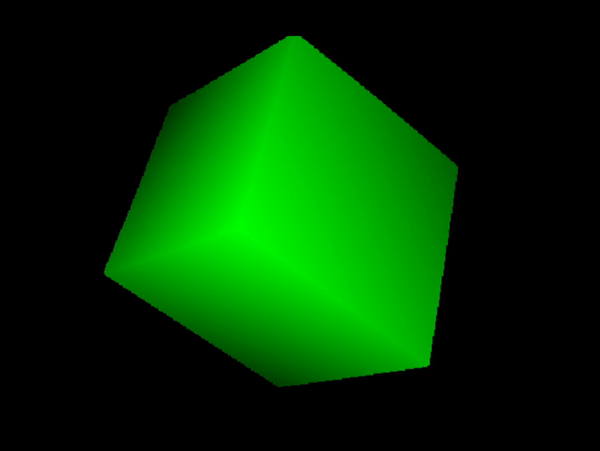

# Java3DRenderer

This is my first program trying to tackle 3D graphics with no external libraries, made completely with Java, formulas from StackOverflow, and a dream.  
<a href="https://github.com/zanbowie138/JavaRaymarcher">Link to this program's successor</a>

### Capabilities
- Able to render one or multiple cubes
- Able to expand code to include spheres, planes, etc.
- Camera movement and cube movement and rotation capability
- FPS counter

### How it works:
The program is run completely on the CPU, and uses mainly line to plane intersection equations to generate a frame.  (Which means it is very inefficient)
  
A very basic rundown of the steps taken to render a single frame:
 
1. Based on the cube's rotation, calculate the normal vectors and vertices for each 6 faces of the cube.  

2. Shoots a ray out of the camera position for each pixel, taking into account camera rotation. 
  1. For each ray, iterate through each plane and calculate the point of intersection with the unconstrained, infinitely large plane (if any).  
   You can check whether or not a vector will intersect with a plane using the dot product of the vector and the plane's normal vector.  
   If it is equal to zero, the vector will never touch the plane because the vector and the plane are parallel. 
   
  2. Then, you calculate if the intersection point is actually within the cube face.   
    1. If we assume that there is a rectangle ABCD, and a point P, you can find whether P is in the rectangle or not. 
      
    The function works by first calculating the sum of all of the triangles, each triangle using two vertices and P.
    If the sum of all of the triangles is greater than the area of the rectangle created by the planes, P is outside.
    (the areas of the triangles are computed using the shoelace theorem)  
  
  3. Finally, knowing the points of intersections (or lack thereof) for each plane, the intersection closest to the camera will be chosen, 
  and will be colored brighter based on how close the intersection is with the camera.

### A rotating cube made by my program:
 

